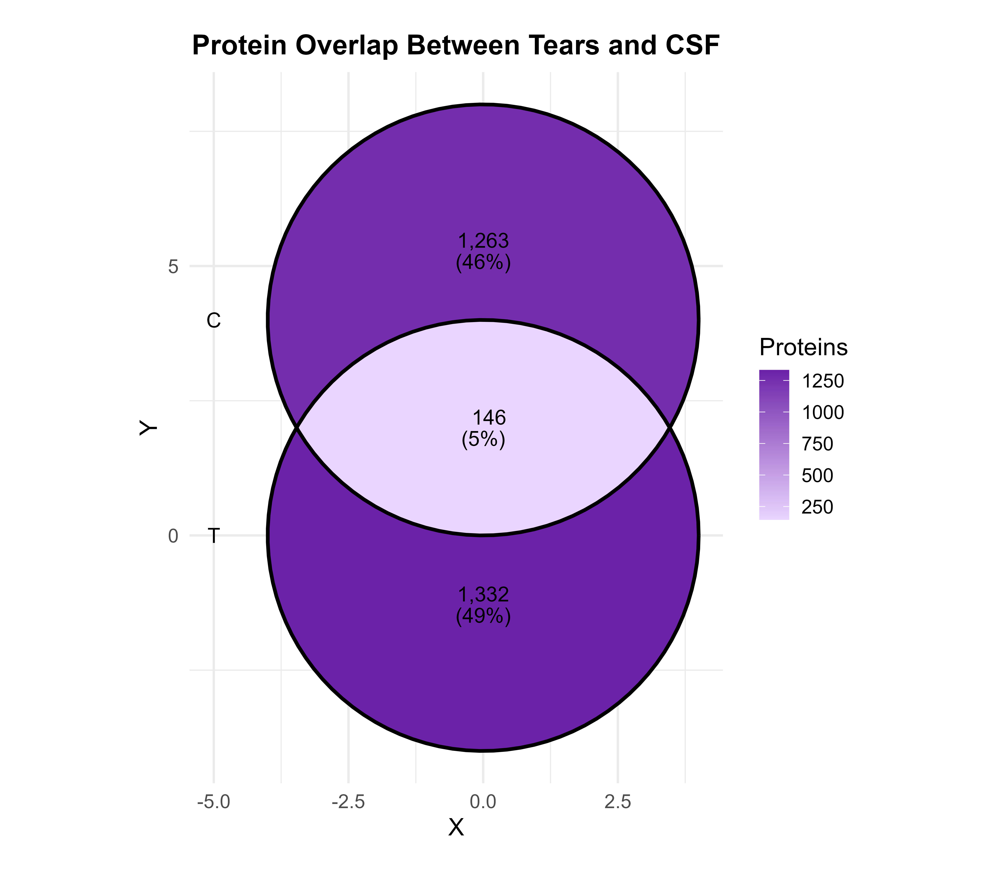
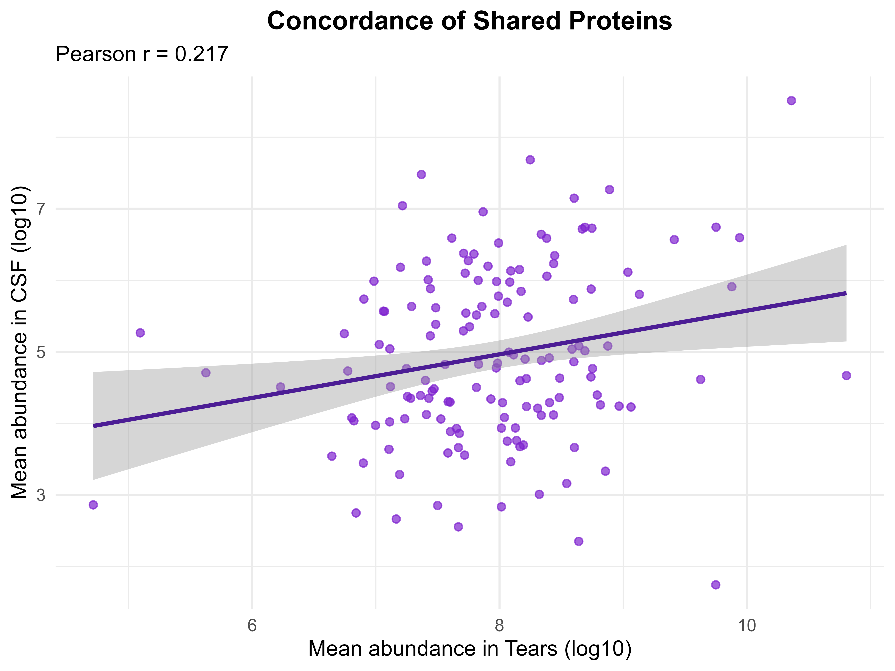
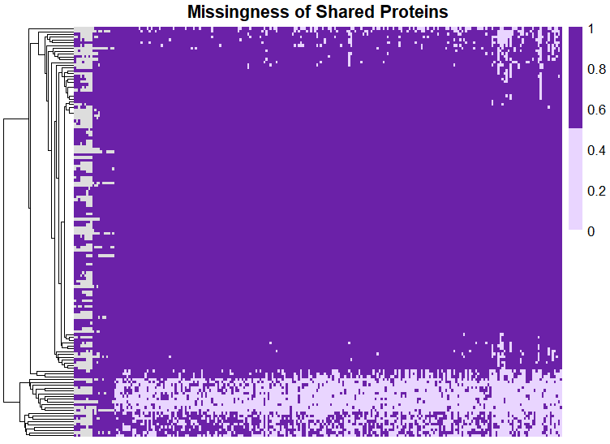
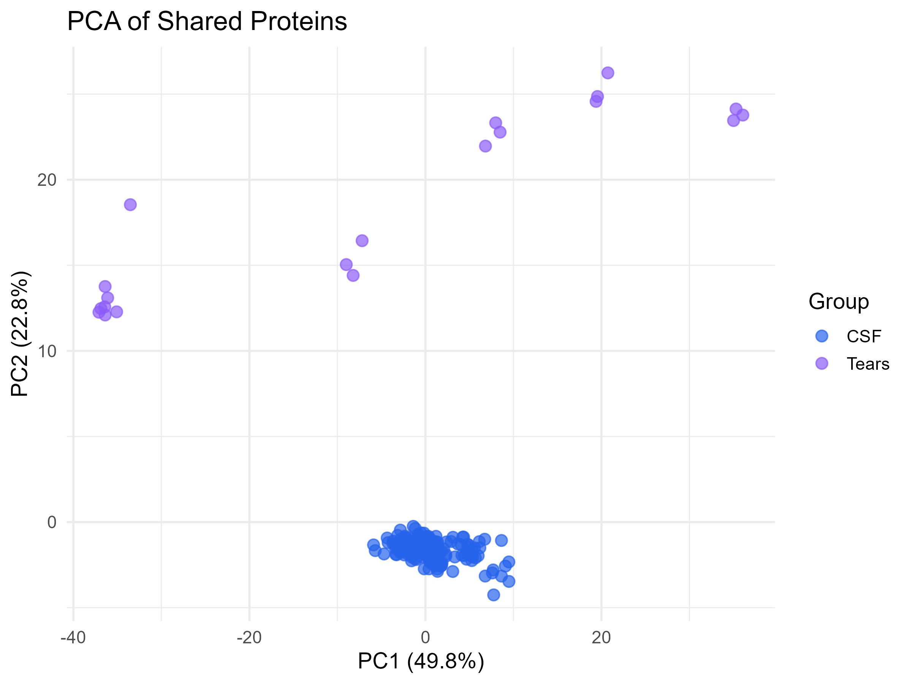
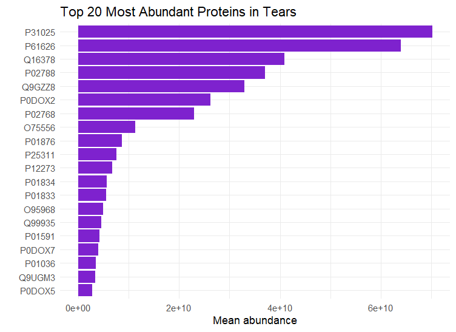
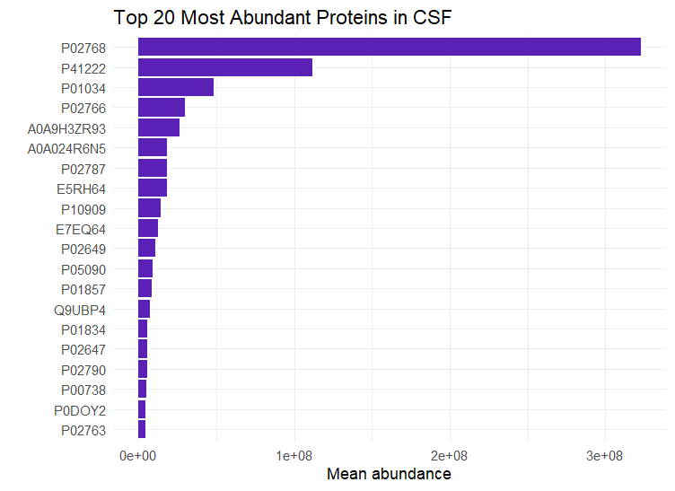

# Proteomic Data Analysis and Comparative Proteomics of Tears and Cerebrospinal Fluid

## Author

**Alina Sobolieva**

Bioinformatics Course Project

---

## Project Overview

This repository contains a bioinformatics workflow for proteomic data processing, quality assessment, and comparative analysis of human biofluids using mass spectrometry-based proteomics datasets.

This project was completed as part of the course **"Introduction to Proteomic Data Analysis"** and integrates data preprocessing, protein-level quantification, quality control, and comparative proteomic analyses to investigate similarities and differences between tear fluid and cerebrospinal fluid (CSF).

---

## Research Question

Can tear fluid serve as a non-invasive source of proteins relevant to the central nervous system and potentially complement cerebrospinal fluid-based biomarker studies?

---

## Data Availability

A portion of the biological datasets used in this study is private and therefore not included in this repository.

The repository contains the complete analysis workflow, processing logic, and visualization scripts. All analyses can be reproduced when the original input datasets are available.

---

## Data Processing Workflow

### Datasets

| Dataset             | Biofluid            | Technology |
| ------------------- | ------------------- | ---------- |
| Tears_DIA           | Tear fluid          | DIA        |
| Tears_DDA           | Tear fluid          | DDA        |
| CSF_DIA             | Cerebrospinal fluid | DIA        |
| Depleted Plasma DIA | Plasma              | DIA        |

### Processing Steps

* Protein-level matrix generation
* Dataset structure evaluation
* Missing value assessment
* DIA versus DDA comparison
* Quality control and validation

### Main Findings

The initial quality assessment demonstrated that DIA-based datasets provided substantially broader proteome coverage compared to DDA datasets.

Protein-level abundance matrices were successfully generated and validated, confirming that all datasets were suitable for downstream comparative proteomic analyses.

---

## Comparative Proteomics Analysis

### Objectives

* Compare proteomic profiles of tears and CSF
* Identify shared and biofluid-specific proteins
* Evaluate abundance concordance between biofluids
* Assess global proteomic similarity
* Investigate the biological relevance of shared proteins

### Analytical Workflow

#### Protein Overlap Analysis

* Identification of shared proteins
* Identification of tears-specific proteins
* Identification of CSF-specific proteins

#### Venn Diagram

Visualization of protein overlap between tears and cerebrospinal fluid.

#### Concordance Analysis

Comparison of average abundance levels of shared proteins using Pearson correlation.

#### Missingness Heatmap

Visualization of protein detection patterns and missing values across samples.

#### Top 20 Most Abundant Proteins

Identification of dominant proteins contributing to the proteomic composition of each biofluid.

#### Principal Component Analysis (PCA)

Evaluation of global proteomic similarity and separation between tears and CSF.

---

## Key Findings

* DIA datasets demonstrated broader proteome coverage than DDA datasets.
* A total of **146 proteins** were shared between tears and cerebrospinal fluid.
* **1332 proteins** were specific to tears.
* **1263 proteins** were specific to cerebrospinal fluid.
* Shared proteins showed low abundance concordance (**Pearson r = 0.217**).
* PCA revealed a clear separation between tears and CSF samples.
* Tears and CSF exhibited substantially different proteomic compositions and biological functions.

---

## Results

### Protein overlap between tears and cerebrospinal fluid



A total of 146 proteins were shared between tears and CSF, while most proteins were biofluid-specific.

---

### Concordance analysis of shared proteins



Pearson correlation analysis demonstrated a weak positive association between protein abundances in tears and CSF, indicating substantial biological differences between the two proteomes.

---

### Missingness heatmap



Protein detection patterns across samples showed heterogeneous protein presence and missingness between biofluids.

---

### Principal Component Analysis (PCA)



PCA revealed clear separation between tear and CSF samples, confirming distinct global proteomic profiles.

---

### Top 20 most abundant proteins in tears



---

### Top 20 most abundant proteins in CSF



---

## Biological Interpretation

Tear fluid was enriched in proteins associated with:

* Ocular surface protection
* Antimicrobial defense
* Immune response

Cerebrospinal fluid was enriched in proteins involved in:

* Molecular transport
* Lipid metabolism
* Neuroprotection
* Central nervous system homeostasis

Although a subset of proteins was shared between the two biofluids, their global proteomic profiles differed considerably.

---

## Conclusions

The initial data processing and quality assessment confirmed that the proteomic datasets were suitable for comparative analysis. DIA-based datasets demonstrated superior proteome coverage and supported robust downstream analyses.

Comparative proteomic analysis revealed limited overlap between tears and cerebrospinal fluid. Only 146 proteins were shared, whereas the majority of proteins were specific to a single biofluid. Low abundance concordance and clear PCA separation further confirmed substantial biological differences between tears and CSF.

The results demonstrate that tear fluid and cerebrospinal fluid represent biologically distinct proteomic environments.

Although tears cannot replace CSF for comprehensive characterization of the central nervous system proteome, the presence of shared proteins highlights their potential as a non-invasive source of selected CNS-related biomarkers.

These findings support further investigation of tear fluid in neurological biomarker discovery and translational proteomics research.

---

## Reproducibility

Raw proteomics datasets are not distributed through this repository because they originate from course-related research materials.

The repository contains all scripts required to reproduce the analytical workflow once the original datasets are available.

---

## Repository Structure

```text
Comparative-Proteomics-Tears-CSF/
│
├── README.md
│
├── script/
│   ├── 01_Data_Processing_and_Quality_Control.R
│   └── 02_Tears_vs_CSF_Comparative_Proteomics.R
│
└── output/
    ├── Project2_Concordance_Plot.png
    ├── Project2_Missingness_Heatmap.png
    ├── Project2_PCA.png
    ├── Project2_Venn_Diagram.png
    ├── Project2_top20csf.png
    └── Project2_top20t.png
```

---

## Software and Packages

The analyses were performed in R using:

* dplyr
* tidyr
* ggplot2
* ggVennDiagram
* pheatmap

---

## Acknowledgements

This project was completed as part of a Bioinformatics course focused on proteomic data analysis and comparative proteomics of human biological fluids.
